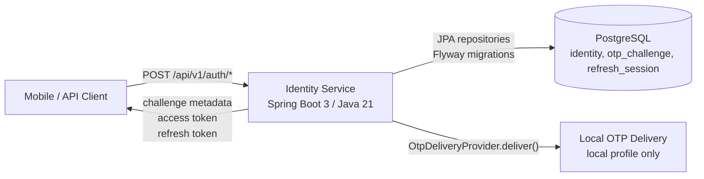
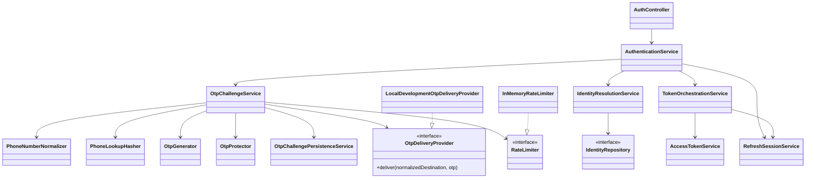
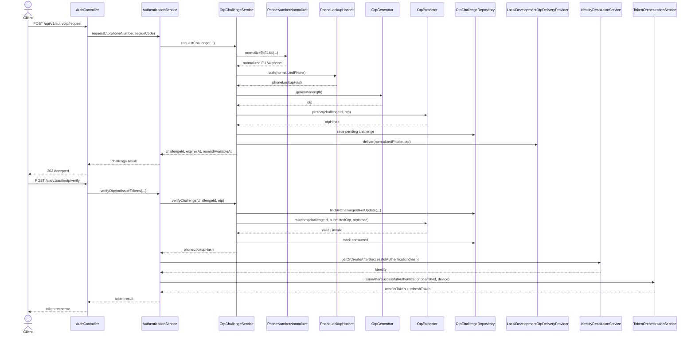
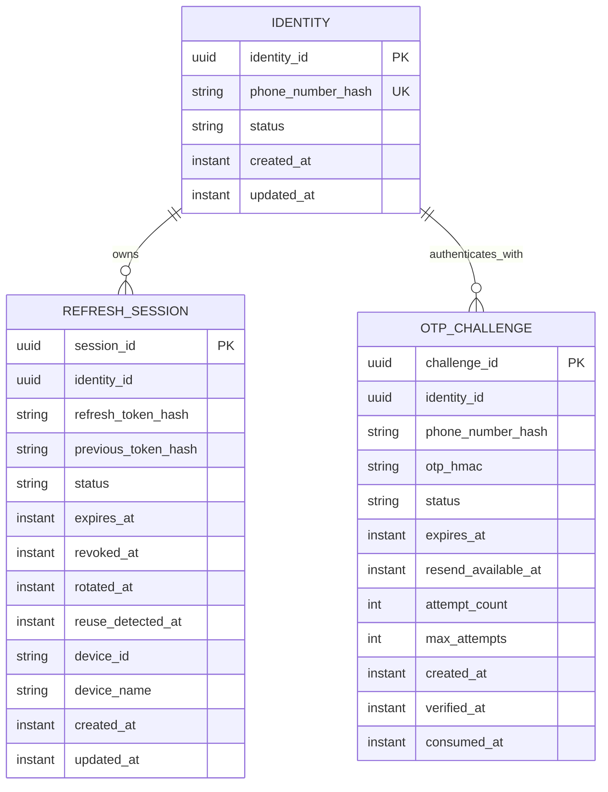
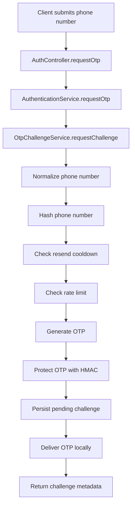
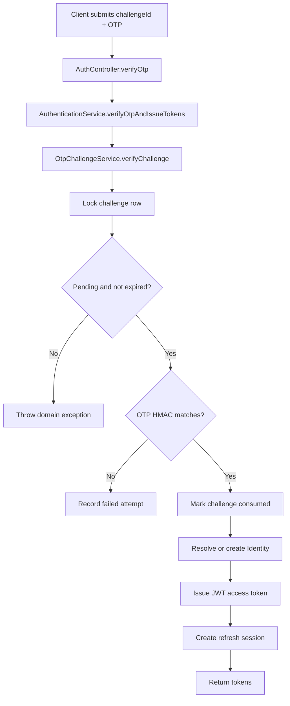

# Identity Service Microservice - Quick Notes

This document summarizes what has been implemented so far in the Identity Service microservice and shows the architecture with renderable Mermaid diagrams.

To view diagrams in VS Code:

1. Open this file.
2. Press `Ctrl+Shift+V` for Markdown Preview.
3. If Mermaid does not render, install a Mermaid Markdown preview extension.

## What The Service Achieved

- Built a Spring Boot 3 / Java 21 identity microservice.
- Implemented package-by-feature structure: `auth`, `otp`, `identity`, `token`, `phone`, `ratelimit`, `security`, `common`.
- Added phone-number OTP authentication.
- Normalized phone numbers to E.164 before use.
- Stored phone lookup values as HMAC hashes instead of raw phone numbers.
- Created OTP challenges with expiry, resend cooldown, max attempts, and rate limiting.
- Added local development OTP delivery through `LocalDevelopmentOtpDeliveryProvider`.
- Issued RS256 JWT access tokens.
- Added opaque refresh tokens with server-side refresh sessions.
- Added refresh-token rotation, logout, expiry, revocation, and reuse detection.
- Added JPA entities and repositories for identities, OTP challenges, and refresh sessions.
- Added Flyway migrations for database schema.
- Added local development environment support with `.env.example`, ignored `.env.local`, and `run-local.ps1`.

## C4 Context



## Component/Class Dependency Diagram



## OTP Request And Verify Sequence



## Persistence / Entity Diagram



## Request Flow



## Verify Flow



## Main Classes

| Class | Package | Responsibility |
|---|---|---|
| `Application` | root | Spring Boot entry point and configuration property scanning. |
| `AuthController` | `auth.api` | Exposes authentication REST endpoints. |
| `AuthenticationService` | `auth.service` | Coordinates OTP, identity resolution, token issuance, refresh, and logout. |
| `OtpChallengeService` | `otp.service` | Handles OTP request and verification business workflow. |
| `OtpChallengePersistenceService` | `otp.service` | Handles transactional OTP challenge persistence. |
| `OtpGenerator` | `otp.service` | Generates numeric OTP values. |
| `OtpProtector` | `otp.service` | HMAC-protects OTP values and verifies submitted OTPs. |
| `LocalDevelopmentOtpDeliveryProvider` | `otp.delivery` | Logs local OTPs when `identity.otp.delivery-provider=local`. |
| `IdentityResolutionService` | `identity.service` | Finds or creates an identity after successful authentication. |
| `PhoneNumberNormalizer` | `phone` | Validates and normalizes phone numbers to E.164. |
| `PhoneLookupHasher` | `phone` | HMAC-hashes normalized phone numbers for private lookup. |
| `TokenOrchestrationService` | `token` | Issues and rotates token pairs. |
| `AccessTokenService` | `token.access` | Issues and verifies RS256 JWT access tokens. |
| `RefreshSessionService` | `token.refresh` | Manages refresh-token sessions and rotation. |
| `SecurityConfiguration` | `security` | Configures stateless Spring Security behavior. |

## Important Methods

| Class | Important functions |
|---|---|
| `AuthController` | `requestOtp`, `verifyOtp`, `refresh`, `logout` |
| `AuthenticationService` | `requestOtp`, `verifyOtpAndIssueTokens`, `refreshTokens`, `logout` |
| `OtpChallengeService` | `requestChallenge`, `verifyChallenge`, `enforceRequestRateLimit`, `enforceResendCooldown` |
| `IdentityResolutionService` | `findByPhoneLookupHash`, `existsByPhoneLookupHash`, `getOrCreateAfterSuccessfulAuthentication` |
| `PhoneNumberNormalizer` | `normalizeToE164` |
| `PhoneLookupHasher` | `hash`, `matches` |
| `TokenOrchestrationService` | `issueAfterSuccessfulAuthentication`, `rotate` |
| `AccessTokenService` | `issue`, `verify` |
| `RefreshSessionService` | `createSession`, `rotate`, `logout` |
| `LocalDevelopmentOtpDeliveryProvider` | `deliver`, `mask` |

## Import / Dependency Notes

| Area | Main imports used | Why |
|---|---|---|
| Spring Boot | `org.springframework.boot.*`, `org.springframework.stereotype.*`, `org.springframework.transaction.annotation.Transactional` | Application startup, service/component registration, transactions. |
| REST API | `org.springframework.web.bind.annotation.*`, `org.springframework.http.*` | HTTP endpoints and response status handling. |
| Validation | `jakarta.validation.*` | Validates request DTOs before service execution. |
| Persistence | `jakarta.persistence.*`, `org.springframework.data.jpa.repository.*` | Entity mapping and repository access. |
| Phone parsing | `com.google.i18n.phonenumbers.*` | Normalizes raw phone numbers to E.164. |
| JWT | `com.nimbusds.jose.*`, `com.nimbusds.jwt.*` | Signs and verifies RS256 JWT access tokens. |
| Crypto | `javax.crypto.Mac`, `javax.crypto.spec.SecretKeySpec`, `java.security.*` | HMAC protection for OTPs, phone lookup, refresh tokens, and RSA key parsing. |
| Time | `java.time.Clock`, `java.time.Instant`, `java.time.Duration` | Testable expiry, cooldown, TTL, and audit timestamps. |

## Endpoint Quick Notes

| Endpoint | Method | Purpose |
|---|---|---|
| `POST /api/v1/auth/otp/request` | `AuthController.requestOtp` | Create OTP challenge and deliver OTP. |
| `POST /api/v1/auth/otp/verify` | `AuthController.verifyOtp` | Verify OTP and issue token pair. |
| `POST /api/v1/auth/token/refresh` | `AuthController.refresh` | Rotate refresh token and issue a new token pair. |
| `POST /api/v1/auth/logout` | `AuthController.logout` | Revoke refresh token session. |

## Local Development Notes

Run the backend:

```powershell
powershell.exe -ExecutionPolicy Bypass -File .\backend\run-local.ps1
```

Health check:

```text
http://localhost:8080/actuator/health
```

If port `8080` is already in use:

```powershell
netstat -ano | findstr :8080
taskkill /PID <PID> /F
```

